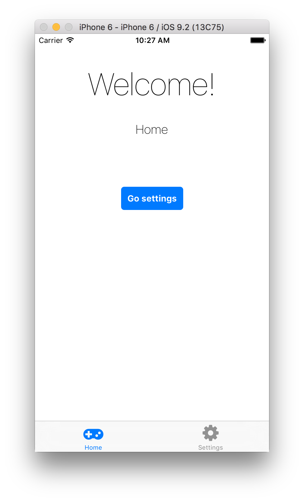

# Showcase of using react-native with Om/next

Here's what I used to create this small showcase app:

- Natal to create the project structure with the `--interface om-next` option (natal 0.1.19)
- https://github.com/oblador/react-native-vector-icons to use custom icons in the TabBar component
- The react-native implementation of Navigator (not NavigatorIos)

# How to run
- `natal launch`
- `natal repl`

# How it works

Notice that both the blue buttons and the tab bar allow to switch between home and settings screens,

# Problems

1. App won't reload changes anymore in `core.cljs` if the ref fn used by the navigator transacts stuff into the app state
2. Hitting CMD-R to reload will throw an exception : `TypeError: undefined is not an object (evaluating 'console._errorOriginal.apply')`

